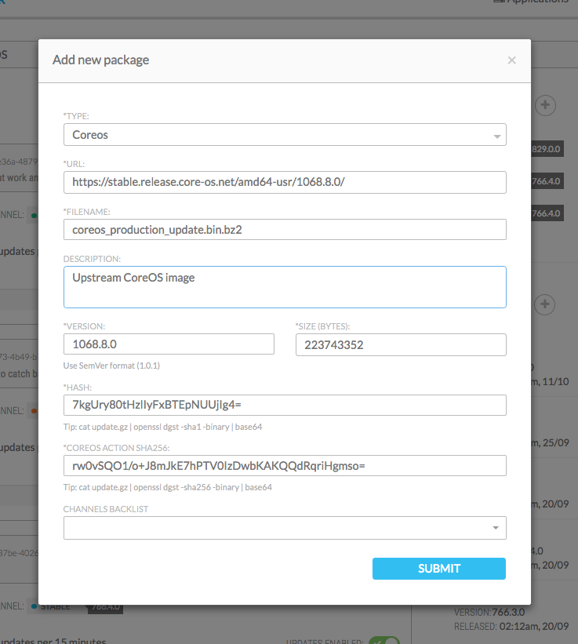

# CoreRoller introduction

<!-- MarkdownTOC depth=6 -->

- [Introduction](#introduction)
- [Concepts](#concepts)
- [Features](#features)
- [Example](#example)

<!-- /MarkdownTOC -->


###### Introduction

[CoreRoller](https://github.com/coreroller/coreroller) is a set of tools to **control and monitor the rollout of your updates**.

It's aimed to be an open source alternative to CoreOS [CoreUpdate](https://coreos.com/products/coreupdate/).


###### Concepts

The key concepts of the update management are:
* Define _a software package_ with a version
* Define on which _release channel_ it applies
* Create _group of machines_

To define an update, assign 1 group to 1 release channel.

You can _promote_ OR _blacklist_ a package from a specific release.


###### Features

* Dashboard to control and monitor your applications updates
* Manage updates for your own applications, not just for CoreOS
* Define your own groups and channels, even for the CoreOS application (pre-installed)
* Define roll-out policies per group, controlling how updates should be applied to a set of instances
* Pause/resume updates at any time at the group level
* Statistics about versions installed in your instances, updates progress status, etc
* Activity stream to get notified about important events or errors
* Manage updates for your CoreOS clusters out of the box
* HTTP Restful APIs
* Based on the Omaha protocol developed by Google


###### Example

For this example, we will use the **"demo" docker image** as explained here https://github.com/coreroller/coreroller#getting-started

```
docker run -d -p 8000:8000 coreroller/demo
```

Once the container is up, just point your browser to: http://localhost:8000/ (Or the IP of the server where CoreRoller is running)

And you should be ready to go. Default username/password is admin/admin.



