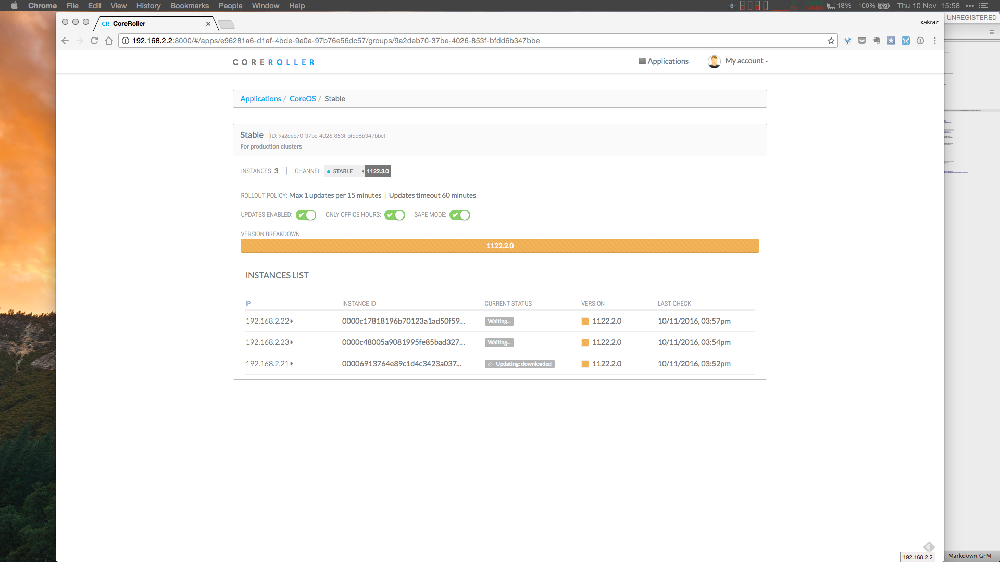
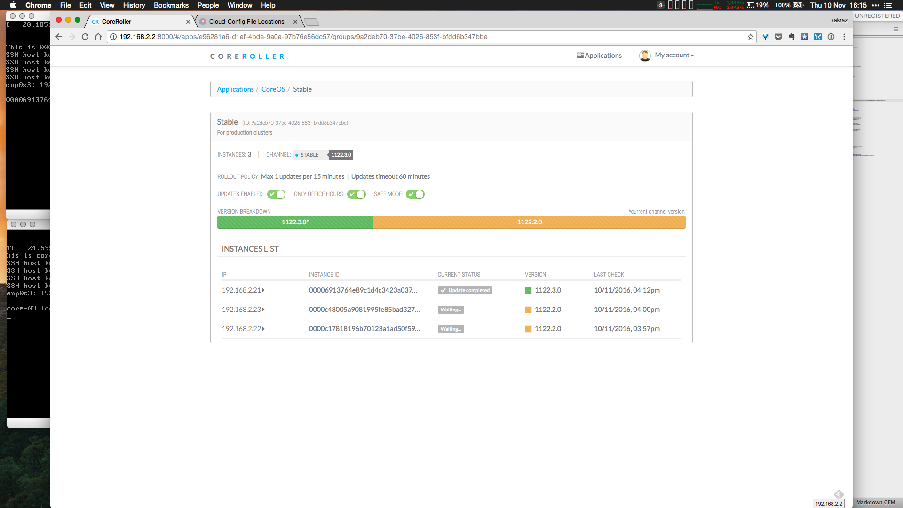
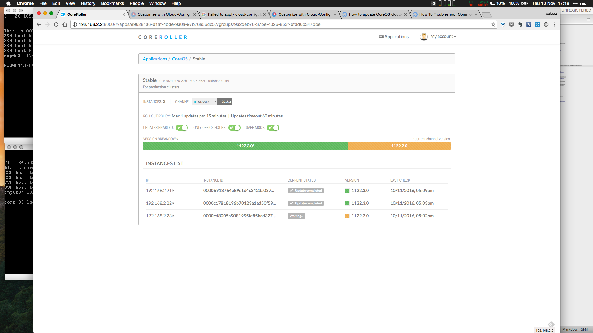
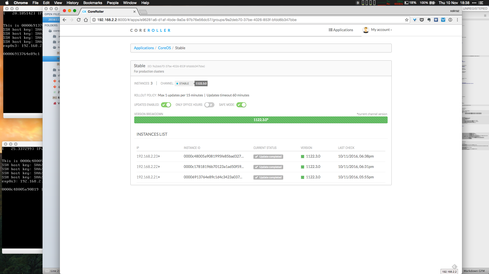

# Update progress follow-up

<!-- MarkdownTOC depth=6 -->

- [C - Update progress follow-up](#c---update-progress-follow-up)
  - [The Update-engine client](#the-update-engine-client)
  - [WebUI](#webui)

<!-- /MarkdownTOC -->


### C - Update progress follow-up

#### The Update-engine client

 If you want to see the update process running on a host, you can force it running this command:

```
update_engine_client -update
```


```
core@core-03 ~ $ update_engine_client -update

[1202/123859:INFO:update_engine_client.cc(243)] Initiating update check and install.
[1202/123859:INFO:update_engine_client.cc(248)] Waiting for update to complete.
LAST_CHECKED_TIME=1480682339
PROGRESS=0.000000
CURRENT_OP=UPDATE_STATUS_UPDATE_AVAILABLE
NEW_VERSION=0.0.0.0
NEW_SIZE=213129575
LAST_CHECKED_TIME=1480682339
...

CURRENT_OP=UPDATE_STATUS_FINALIZING
NEW_VERSION=0.0.0.0
NEW_SIZE=213129575

Broadcast message from locksmithd at 2016-12-02 12:40:34.136894924 +0000 UTC:
System reboot in 5 minutes!

LAST_CHECKED_TIME=1480682339
PROGRESS=0.000000
CURRENT_OP=UPDATE_STATUS_UPDATED_NEED_REBOOT
NEW_VERSION=0.0.0.0
NEW_SIZE=213129575
[1202/124034:INFO:update_engine_client.cc(193)] Update succeeded -- reboot needed.
```


#### WebUI









